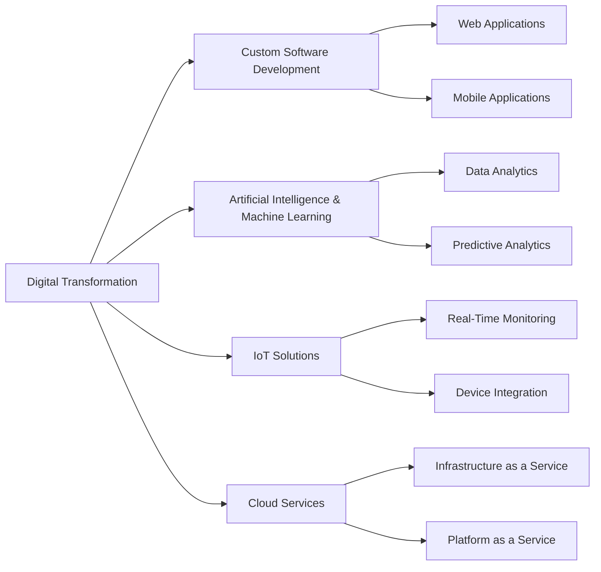

# Uryx Technologies

👋 Welcome to the official repository of **Uryx Technologies**!

We are a company dedicated to digital transformation, committed to driving innovation and efficiency through comprehensive technology solutions. Our focus combines high-quality software development with advanced digital strategies, all designed to empower businesses in today's modern era.

---

## About Us

At Uryx Technologies, we specialize in:
- **Custom Software Development:** Creating scalable solutions tailored to each client's unique needs.
- **Artificial Intelligence & Machine Learning:** Leveraging automation and predictive analytics to turn data into strategic insights.
- **Internet of Things (IoT):** Connecting devices and processes to optimize operations and drive value.
- **Cloud Services:** Offering secure, flexible infrastructure that supports limitless digital transformation.

---

## Our Mission, Vision, and Values

### Mission
To drive innovation in every project by providing technology solutions that transform and optimize our clients' operations.

### Vision
To be global leaders in digital transformation, recognized for our adaptability, quality, and unwavering commitment to our clients’ success.

### Values
- **Innovation:** We foster a culture of creativity and continuous improvement.
- **Excellence:** We are committed to quality in every line of code and strategic decision.
- **Collaboration:** We value teamwork and strategic partnerships.
- **Integrity:** We operate with ethics, transparency, and respect.
- **Customer Focus:** We listen to and understand our clients’ needs to deliver effective solutions.

---

## Our Services

### Software Development
- Web and mobile applications.
- Systems integration and process automation.
- Custom platforms for industrial and business sectors.

### Artificial Intelligence and Big Data
- Machine learning algorithms for predictive analytics.
- Advanced analytics and data visualization solutions.
- Implementation of chatbots and virtual assistants.

### IoT Solutions
- Device connectivity to optimize processes.
- Real-time monitoring and data analysis.
- Projects in smart cities and industrial automation.

### Cloud Services
- Migration and implementation of cloud infrastructures.
- Management and support for secure environments.
- Scalability and flexibility to foster business growth.

---

## Market Ecosystem Diagram

Below is a visual representation of our market ecosystem and how our services drive digital transformation:

## Portfolio and Success Stories

We have collaborated with a diverse range of industries—from startups to established corporations—developing solutions that have:
- **Optimized production processes**
- **Enhanced operational efficiency**
- **Reduced costs and improved decision-making**

For more details on our projects and success stories, please visit our [Portfolio](#).

---

## Our Team

The heart of Uryx Technologies is our multidisciplinary team of technology, innovation, and business experts. Each member brings unique expertise and passion, working together to achieve outstanding results.  
Learn more about our team in our [Our Story](#) section.

---

## Collaboration and Contribution

We welcome collaborations and strategic partnerships that foster innovation. Whether you’re a company, developer, or tech professional, get in touch to explore opportunities for joint growth.

### How Can You Contribute?
- Reporting issues or suggesting improvements.
- Participating in our open-source projects.
- Collaborating on innovative technology initiatives.

For more details, check our [Contribution](#) section.

---

## Blog and Resources

Stay updated with the latest trends in technology, AI, IoT, and digital transformation on our [Blog](#). Here, our experts share articles, guides, and resources designed to inspire and empower your projects.

---

## Testimonials and Clients

The trust of our clients is our greatest endorsement. Discover how we have transformed businesses and improved operations through client testimonials and success stories.  
Visit our [Testimonials](#) section to learn more.

---

## Contact Us

If you have any questions, collaboration proposals, or want to learn more about our services, feel free to reach out:

- 📧 **Email:** [contact@uryxtech.com](mailto:contact@uryxtech.com)
- 🔗 **LinkedIn:** [Uryx Technologies](#)
- 🌐 **Website:** [www.uryxtech.com](#)

---

## Fun Fact

⚡ **Fun Fact:** We believe every challenge is an opportunity to innovate. At Uryx Technologies, every line of code and each project is a step toward shaping the digital future.

---

This repository reflects our commitment to excellence, innovation, and collaboration. We invite you to explore our projects and join our technological journey!
